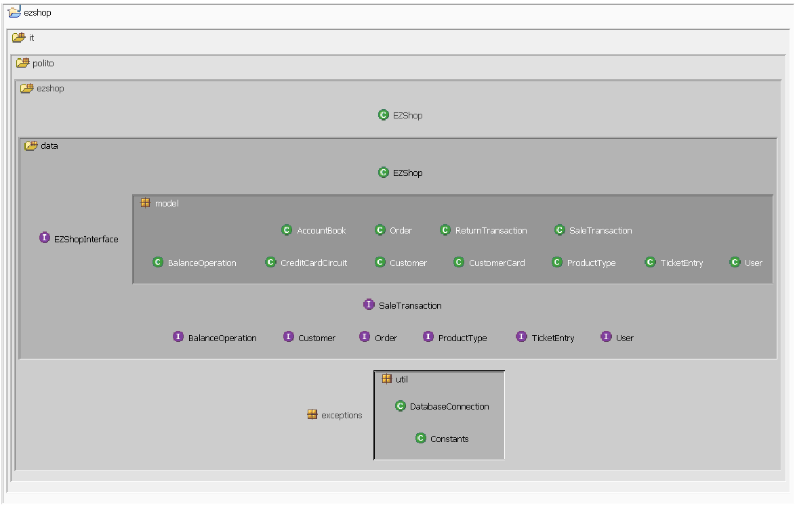
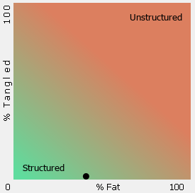
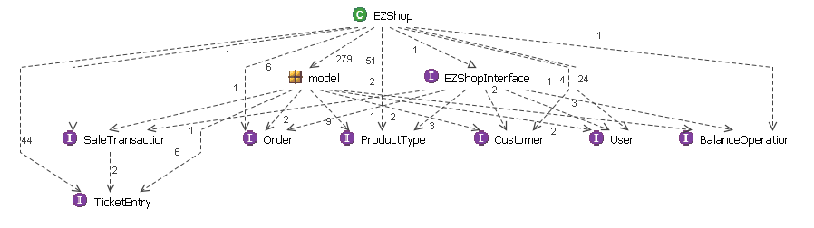

# Design assessment


```
<The goal of this document is to analyse the structure of your project, compare it with the design delivered
on April 30, discuss whether the design could be improved>
```


# Levelized structure map

```
<Applying Structure 101 to your project, version to be delivered on june 4, produce the Levelized structure map,
with all elements explosed, all dependencies, NO tangles; and report it here as a picture>
```



# Structural over complexity chart

```
<Applying Structure 101 to your project, version to be delivered on june 4, produce the structural over complexity chart; and report it here as a picture>
```



# Size metrics

```
<Report here the metrics about the size of your project, collected using Structure 101>
```

| Metric                                    | Measure |
| ----------------------------------------- | ------- |
| Packages                                  | 7       |
| Classes (outer)                           | 42      |
| Classes (all)                             | 42      |
| NI (number of bytecode instructions)      | 8,324   |
| LOC (non comment non blank lines of code) | 3,579   |


# Items with XS

```
<Report here information about code tangles and fat packages>
```

| Item                                | Tangled | Fat  | Size  | XS   |
| ----------------------------------- | ------- | ---- | ----- | ---- |
| ezshop.it.polito.ezshop.data        | 8%      | 2    | 7,946 | 629  |
| ezshop.it.polito.ezshop.data.EZShop |         | 140  | 3,610 | 515  |


# Package level tangles

```
<Report screen captures of the package-level tangles by opening the items in the "composition perspective" 
(double click on the tangle from the Views->Complexity page)>
```



# Summary analysis

```
<Discuss here main differences of the current structure of your project vs the design delivered on April 30>
<Discuss if the current structure shows weaknesses that should be fixed>
```

The structure of this project has been improved throughout the implementation and testing part in order to hit the target required with minimum casualties. 

<b>Changes:</b>

1. On the packages level 
   we have moved the package <i>"it.polito.ezshop.model"</i> to <i>"it.polito.ezshop.data.model"</i>. 

   The main reason behind this change is purely the high tangled percentage that we have obtained in "Structural over-complexity" graph. After moving the package, we have obtained a significantly low tangled percentage.  

2. In the classes level 

   Through the development period, we have decided to :

   a. Remove <i>Credit</i> and <i>Debit</i> classes, for a more reliable dependency between classes. 
   b. Make <i>BalanceOperation</i> and <i>TicketEntry</i> persistent classes

   c. Remove <i>ProductPosition</i> class 

   d. Add <i>CreditCardCircuit</i> class, which handles the read/write operations related to the credit card text file we received during the implementation period.

<b>Improvements:</b>

 Although we were able to handle the high tangled percentage and lower it to hit an 8% value, further improvements may be applied to lower this value and make it reach 0%. 
Additionally, in the design currently applied to the project, all the needed functionalities per API were implemented exclusively inside each API. Hence, the high estimation of FAT in class <i>"ezshop.it.polito.ezshop.data.EZShop"</i>. Surely, this may be easily improved by braking down the logic step by step into functions, which will be moved into specific managers considering the model involved in the operation.  