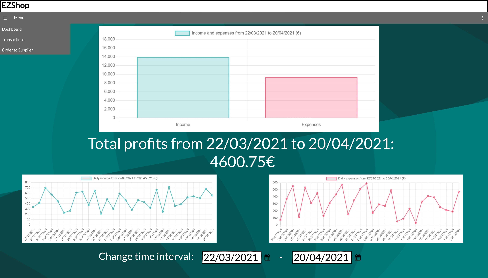

# Graphical User Interface Prototype  

Authors: Claudio Tancredi (s292523), Ehsan Ansari Nejad (s288903), Takla Trad (s289222)

Date: 21/04/2021

Version: 1.0

### "Login" page
Users profiles are added to Google Sheets by the Administrator. A user (Cashier/Owner) can login by entering its username and password and pressing the "Log in" button.  
  
### Cashier - "Customer shopping cart" page
When the cashier logs in this will be the landing page:  
  
The cashier can already start scanning products, which will appear in the table. If the bar code reader is, for any reason, not working, the cashier can manually insert the products codes and confirm to get their data. Buttons that are not needed in this situation are disabled.  
After a while the table will be populated like this:

Now, on the left side of the navbar there is a button that opens a menu that is useful to change the page. The menu will be like this:

On the right side of the navbar there's a button too, it will open an options menu where the user can log out:

In the table there are some buttons (+ in green, - in red, the trash icon) useful to manage the shopping cart. The + button will increase the quantity for a product by 1 (useful when a customer picks another thing at the very last moment), the - button will decrease the quantity by 1. The trash button will delete the entire row of the product, so it's a way to discard all the instances of a product. There's also the "Empty cart" button that is useful to clean all the table. The total amount is updated in real-time.  
When the cashier finishes managing the shopping cart he will start the transaction. If the transaction is in cash, he will ask the customer for the computed amount and he will receive a certain amount. The cashier inserts this amount in the field "cash paid amount" and presses on the "Compute change" button to get the change:

The cashier can then proceed with the transaction and when he finishes he can press the "Complete transaction (cash)" button to update transactions and inventory on storage.  
He will get a message like this:

Instead, if the payment method is credit card, there is no need to compute a change and the cashier can press the "Complete transaction (credit card)" button. A popup will appear:

After the transaction has been succesfully processed a message will appear:

The cashier can close the window and the shopping cart will be automatically emptied, so that a new customer can be served.
### Cashier - "Scan products delivered by supplier" page
The cashier can reach this page through the left menu.  
The page will appear like this:

Here the cashier can start scanning products in the same way he does in the landing page.  
After a while, the table will be populated:

Here the trash button and the "Empty list" button will work in the same way as before.  
When a product is scanned it is searched for in the inventory. If it is in the inventory, then its bar code, name, price per unit are retrieved, otherwise (= the product is new) in the row there will be only the information about the bar code (like in the third row). The cashier can set the quantity that has arrived and set the missing information for the new product.  
Then the cashier can press the "Update inventory" button. A message will be shown:

The cashier can close the window and the list will be automatically emptied.
### Owner - "Dashboard" page
This will be the landing page for the owner, where he can see his financial report:

The owner can change the time interval and the information (charts and total profits) will be updated accordingly.  
The navbar will have again menus. Left menu:

Right menu:

### Owner - "Transactions" page
This page will look like this:

Here the owner can see customers transactions, his orders, can filter them by customer credit card number and supplier name, can change the time interval (and the transactions will be updated accordingly).  
### Owner - "Order to Supplier" page
This page will look like this:

Here the owner can either manually fill the e-mail template or select a product and a supplier from the tables and the e-mail will be automatically partially filled (as seen in the image). The owner can also filter suppliers by name and press on the "Clear all" button to clear all selections and the e-mail template.  
When he finishes, he can send the e-mail and he needs to pay, so he will get a message like this one:

After the transaction has been succesfully processed a message will appear:

The owner can close the window, then the e-mail and the selections will be automatically cleared, so that the owner can eventually start a new order.