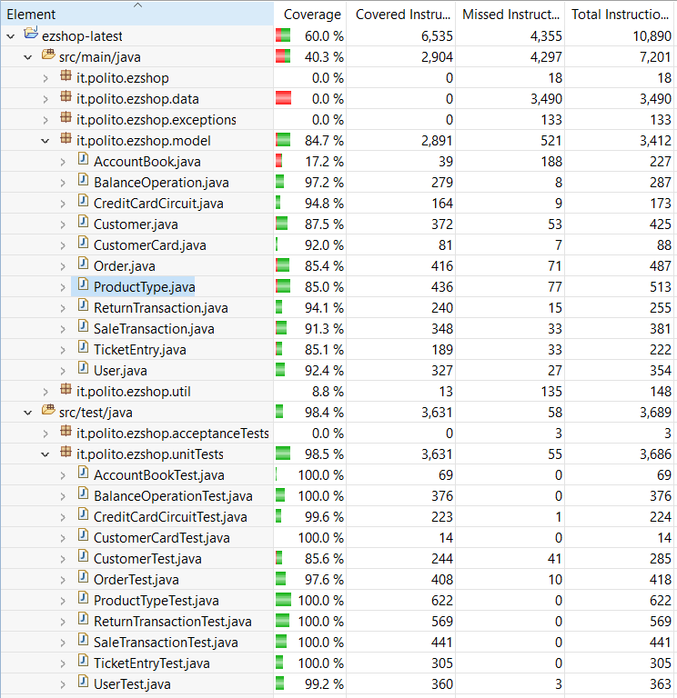

# Unit Testing Documentation

Authors: Ehsan Ansari Nejad (s288903), Takla Trad (s289222)

Date: 19-05-2021

Version: 1.0

# Contents

- [Black Box Unit Tests](#black-box-unit-tests)

- [White Box Unit Tests](#white-box-unit-tests)

# Black Box Unit Tests

    <Define here criteria, predicates and the combination of predicates for each function of each class.
    Define test cases to cover all equivalence classes and boundary conditions.
    In the table, report the description of the black box test case and (traceability) the correspondence with the JUnit test case writing the 
    class and method name that contains the test case>
    <JUnit test classes must be in src/test/java/it/polito/ezshop   You find here, and you can use,  class TestEzShops.java that is executed  
    to start tests
    >

 

**Class *ProductType* - method *setQuantity*** 

**Criteria for method *setQuantity*:**

 - Validity
 - Sign

| Criteria | Predicate    |
| -------- | ------------ |
| Validity | [1, maxint)  |
|          | (Mininit, 1) |
| Sign     | (minint, 0)  |
|          | [0, maxint)  |

**Boundaries**:

| Criteria | Boundary values |
| -------- | --------------- |
| Sign     | -1, 0, maxint   |

**Combination of predicates**:

| Validity | Sign        | Valid / Invalid | Description of the test case | JUnit test case |
|-------|-------|-------|-------|-------|
|*|(minint, 0)|InValid|T1(-2) -> ERROR|ProductTypeTest.testNegativeSetQuantity()|
|(Mininit, 1)|*|InValid|T2(NULL) -> ERROR|ProductTypeTest.testInvalidSetQuantity()|
|[1, maxinit]|[0, maxint)|Valid|T3(20) -> quantity=20|ProductTypeTest.testPositiveSetQuantity()|

 ### **Class *ProductType* - method *setProductDescription***

**Criteria for method *setProductDescription*:**

 - Validity
 - String length

**Predicates for method *getProductTypeByBarCodeFromDb*:**

| Criteria      | Predicate  |
| ------------- | ---------- |
| Validity      | Valid      |
|               | InValid    |
| String length | > 0        |
|               | =0 (EMPTY) |

**Combination of predicates**:
| Validity | String length | Valid / Invalid | Description of the test case                  | JUnit test case                                     |
| -------- | ------------- | --------------- | --------------------------------------------- | --------------------------------------------------- |
| NULL     | *             | Invalid         | T1(null) -> ERROR                             | ProductTypeTest.testNullSetProductDescription()     |
| *        | =0            | Invalid         | T2("") -> ERROR                               | ProductTypeTest.testInvalidSetProductDescription()  |
| Valid    | >0            | Valid           | T3("yellow") -> productDescription = "yellow" | ProductTypeTest.testPositiveSetProductDescription() |

 ### **Class *ProductType* - method *setBarcode***
**Criteria for method *setBarcode*:**
 - Validity
 - String length

**Predicates for method *getProductTypesByDescriptionFromDb*:**

| Criteria      | Predicate  |
| ------------- | ---------- |
| Validity      | Valid      |
|               | InValid    |
| String length | > 0        |
|               | =0 (EMPTY) |

**Combination of predicates**:
| Validity of the String BarCode | Lenght of the String BarCode | Valid / Invalid | Description of the test case                     | JUnit test case                          |
|-------|-------|-------|-------|-------|
| InValid                        | *                            | InValid         | T1(null) -> ERROR                                | ProductTypeTest.testProductTypeNullSetBarCode() |
| *                              | =0                           | InValid         | T2("") -> ERROR                                  | ProductTypeTest.testPtroductTypeInvalidSetBarCode() |
| Valid                          | >0                           | Valid           | T3("9330462119318") -> barCode = "9330462119318" | ProductTypeTest.testProductTypePositiveSetBarCode() |

 ### **Class *ProductType* - method *setPricePerUnit***
**Criteria for method *setPricePerUnit*:**
 - Validity 
 - Sign

**Predicates for method *updateQuantityInDb*:**

| Criteria | Predicate       |
| -------- | --------------- |
| Sign     | (-maxdouble, 0) |
|          | [0, maxdouble)  |
| Validity | Valid           |
|          | InValid         |

**Boundaries**:

| Criteria | Boundary values |
| -------- | --------------- |
| Sign     | 0, 0.0001       |

**Combination of predicates**:

| Sign            | Validity | Valid / Invalid | Description of the test case  | JUnit test case                               |
|-------|-------|-------|-------|-------|
| (-maxdouble, 0) | *        | InValid         | T1(-0.50) -> ERROR            | ProductTypeTest.testNegativeSetPricePerUnit() |
| *               | InValid  | InValid         | T2(null) -> ERROR             | ProductTypeTest.testInvalidSetPricePerUnit()  |
| [0, maxdouble)  | Valid    | Valid           | T3(0.60) -> pricePerUnit=0.60 | ProductTypeTest.testPositiveSetPricePerUnit   |

 ### **Class *ProductType* - method *setId***

**Criteria for method *setId*:**    

 - Validity
 - Sign

**Predicates for method *setId***

| Criteria | Predicate   |
| -------- | ----------- |
| Validity | Valid       |
|          | InValid     |
| Sign     | (minint, 1) |
|          | [1, maxint) |

**Combination of predicates**:

| Validity | Sign        | Valid / Invalid | Description of the test case | JUnit test case |
|-------|-------|-------|-------|-------|
| *        | (minint, 0) | InValid         | T1(-5) -> ERROR              | ProductTypeTest.testNegativeSetId() |
| InValid  | *           | InValid         | T2(NULL) -> ERROR            | ProductTypeTest.testInvalidSetId()  |
| Valid    | [0, maxint) | Valid           | T3(5) -> id=20               | ProductTypeTest.testPositiveSetId() |

 ### **Class *Customer* - method *setCustomerName***

**Criteria for method *setCustomerName*:**

 - Validity
 - Length

**Predicates for method *setCustomerName*:**

| Criteria | Predicate |
| -------- | --------- |
| Validity | Valid     |
|          | Invalid   |
| Length   | >0        |
|          | =0        |

**Combination of predicates**:

| Validity | Length | Valid / Invalid | Description of the test case | JUnit test case |
|-------|-------|-------|-------|-------|
|Invalid|*|Invalid|T1(Invalid)=>Error|CustomerTest.testCustomerInvalidSetCustomerName()|
|*|=0|Invalid|T2(null)=>Error|CustomerTest.testCustomerNullSetCustomerName()|
|Valid|>0|Valid|T3(Valid)=>success|CustomerTest.testCustomerValidSetCustomerName()|

 ### **Class *Customer* - method *setCustomerCard***

**Criteria for method *setCustomerCard*:**

 -  Validity

 -    Length

   **Predicates for method *setCustomerName*:**

| Criteria | Predicate |
| -------- | --------- |
| Validity | Valid     |
|          | Invalid   |
| Length   | >0        |
|          | =0        |

   

   **Combination of predicates**:

| Validity | Length | Valid / Invalid | Description of the test case | JUnit test case                                   |
| -------- | ------ | --------------- | ---------------------------- | ------------------------------------------------- |
| Invalid  | *      | Invalid         | T1(Invalid)=>Error           | CustomerTest.testCustomerInvalidSetCustomerCard() |
| *        | =0     | Invalid         | T2(null)=>Error              | CustomerTest.testCustomerNullSetCustomerCard()    |
| Valid    | >0     | Valid           | T3(Valid)=>success           | CustomerTest.testCustomerValidSetCustomerCard()   |

    ### 

**Class *Customer* - method *setId***

**Criteria for method *setId*:**    

 - Validity

**Predicates for method *setId*:**

| Criteria | Predicate   |
| -------- | ----------- |
| Validity | [1, maxint) |
|          | (minint, 1) |

**Boundaries**:

| Criteria | Boundary values |
| -------- | --------------- |
| Validity | 0,1             |

**Combination of predicates**:

| Validity    | Valid / Invalid | Description of the test case | JUnit test case                          |
| ----------- | --------------- | ---------------------------- | ---------------------------------------- |
| [1, maxint) | Valid           | T1(1) -> success             | CustomerTest.testCustomerPositiveSetId() |
| (minint, 1) | Invalid         | T2(-1)->error                | CustomerTest.testCustomerNegativeSetId() |

 ### **Class *Customer* - method *setPoints***

**Criteria for method *setPoints*:**

 - Validity

**Predicates for method *setPoints*:**

| Criteria | Predicate   |
| -------- | ----------- |
| Validity | [1, maxint) |
|          | (Minint, 1) |

**Boundaries**:

| Criteria | Boundary values |
| -------- | --------------- |
| Validity | 0               |

**Combination of predicates**:

| Validity | Valid / Invalid | Description of the test case | JUnit test case |
|-------|-------|-------|-------|
|(Minint, 1)|Invalid|T1(-1)=>Error|CustomerTest.testCustomerNegativeSetPoints()|
|[1, maxint)|Valid|T2(2)=>success|CustomerTest.testCustomerPositiveSetPoints()|

 ### **Class *BalanceOperation* - method *setBalanceId***

**Criteria for method *setBalanceId*:**

 - Validity

**Predicates for method *setBalanceId*:**

| Criteria | Predicate   |
| -------- | ----------- |
| Validity | [1, maxint) |
|          | (minint, 1) |

**Boundaries**:

| Criteria | Boundary values |
| -------- | --------------- |
| Validity | 0,1             |

**Combination of predicates**:

| Validity    | Valid / Invalid | Description of the test case | JUnit test case |
|-------|-------|-------|-------|
|[1, maxint)| Valid           | T1(1) -> success             | BalanceOperationTest.testPositiveSetBalanceId() |
| (minint, 1) | Invalid         | T2(-1)->error                | BalanceOperationTest.testNegativeSetBalanceId() |

 ### **Class *BalanceOperation* - method *setDate***

**Criteria for method *setDate*:**

 - Validity

**Predicates for method *setDate*:**

| Criteria | Predicate |
| -------- | --------- |
| Validity | Valid     |
|          | InValid   |

**Combination of predicates**:

| Validity | Valid / Invalid | Description of the test case | JUnit test case |
|-------|-------|-------|-------|
| NULL     | Invalid         | T1(null) -> ERROR                                            | BalanceOperationTest.testNullSetDate()  |
| Valid    | Valid           | Date=LocalDate.parse("2021-05-22") T2(Date) -> date=LocalDate.parse("2021-05-22") | BalanceOperationTest.testValidSetDate() |

 ### **Class *BalanceOperation* - method *setType***

**Criteria for method *setType*:**

 - Validity
 - Type Validity

**Predicates for method *setType*:**

| Criteria      | Predicate                                        |
| ------------- | ------------------------------------------------ |
| Validity      | Valid                                            |
|               | Invalid                                          |
| Type Validity | Valid = "SALE","ORDER","RETURN","DEBIT","CREDIT" |
|               | Invalid                                          |

**Combination of predicates**:

| Validity | Type Validity                                    | Valid / Invalid | Description of the test case                                 | JUnit test case                            |
|-------|-------|-------|-------|-------|
| Invalid  | *                                                | Invalid         | T1(null) -> type not setted                                  | BalanceOperationTest.testNullSetType()     |
| *        | Invalid                                          | Invalid         | T2(" ") -> type not setted                                   | BalanceOperationTest.testInvalidSetType()  |
| Valid    | Valid = "SALE","ORDER","RETURN","DEBIT","CREDIT" | Valid           | T3("SALE ") -> type="SALE"   T3.1("ORDER") -> type="ORDER"  T3.2("RETURN") -> type="RETURN"  T3.3("DEBIT") -> type="DEBIT"  T3.4("CREDIT") -> type="CREDIT"   | BalanceOperationTest.testPositiveSetType() |

 ### **Class *User* - method *setId***

**Criteria for method *setId*:**

 - Validity

**Predicates for method *setId*:**

| Criteria | Predicate   |
| -------- | ----------- |
| Validity | [1, maxint) |
|          | (minint, 1) |

**Boundaries**:

| Criteria | Boundary values |
| -------- | --------------- |
| Validity | 0,1             |

**Combination of predicates**:

| Validity | Valid / Invalid | Description of the test case | JUnit test case |
|-------|-------|-------|-------|
|[1, maxint)|Valid|T1(1) -> success|UserTest.testUserPositiveSetId()|
|(minint, 1)|Invalid|T2(-1)->error|UserTest.testUserNegativeSetId()|

 ### **Class *User* - method *setUsername***

**Criteria for method *setUsername*:**

 - Validity of username
 - Length

**Predicates for method *setUsername*:**

| Criteria             | Predicate |
| -------------------- | --------- |
| Validity of username | Valid     |
|                      | Invalid   |
| Length               | >0        |
|                      | =0        |

**Combination of predicates**:

| Validity of username | Length | Valid / Invalid | Description of the test case | JUnit test case |
|-------|-------|-------|-------|-------|
|Invalid|*|Invalid|T1(null)=>error|UserTest.testUserInvalidsetUsername()|
|*|=0|Invalid|T2(" ")=>error|UserTest.testUserNullsetUsername()|
|Valid|>0|Valid|T3("username")=>success|UserTest.testUserPositivesetUsername()|

 ### **Class *User* - method *setPassword***

**Criteria for method *setPassword*:**

 - Validity
 - Length

**Predicates for method *setPassword*:**

| Criteria | Predicate |
| -------- | --------- |
| Validity | Valid     |
|          | Invalid   |
| Length   | >0        |
|          | =0        |

**Combination of predicates**:

| Validity | Length | Valid / Invalid | Description of the test case | JUnit test case |
|-------|-------|-------|-------|-------|
|Invalid|*|Invalid|T1(null)=>error|UserTest.testUserInvalidsetUsername()|
|*|=0|Invalid|T2(" ")=>error|UserTest.testUserNullsetUsername()|
|Valid|>0|Valid|T3("username")=>success|UserTest.testUserPositivesetUsername()|

 ### **Class *User* - method *setRole***

**Criteria for method *setRole*:**

 - Validity of role
 - Length

**Predicates for method *setRole*:**

| Criteria         | Predicate |
| ---------------- | --------- |
| Validity of role | Valid     |
|                  | Invalid   |
| Length           | >0        |
|                  | =0        |

**Combination of predicates**:

| Validity of role | Length | Valid / Invalid | Description of the test case | JUnit test case |
|-------|-------|-------|-------|-------|
|Invalid|*|Invalid|T1(invalid)=>error|UserTest.testUserInvalidSetRole()|
|*|=0|Invalid|T2(null)=>error|UserTest.testUserNullSetRole()|
|Valid|>0|Valid|T3(role)=>success|UserTest.testUserValidSetRole()|

 ### **Class *SaleTransaction* - method *setTicketNumber***

**Criteria for method *setTicketNumber*:**

 - Validity
 - Sign

**Predicates for method *setTicketNumber***

| Criteria | Predicate   |
| -------- | ----------- |
| Validity | Valid       |
|          | InValid     |
| Sign     | (minint, 1) |
|          | [1, maxint) |

**Combination of predicates**:

| Validity | Sign        | Valid / Invalid | Description of the test case | JUnit test case                                   |
| -------- | ----------- | --------------- | ---------------------------- | ------------------------------------------------- |
| *        | (minint, 0) | InValid         | T1(-1) -> ERROR              | SaleTransactionTest.testNegativeSetTicketNumber() |
| InValid  | *           | InValid         | T2(NULL) -> ERROR            | SaleTransactionTest.testNullSetTicketNumber()     |
| Valid    | [0, maxint) | Valid           | T3(1) -> id=1                | SaleTransactionTest.testPositiveSetTicketNumber() |

 ### **Class *SaleTransaction* - method *setDiscountRate***

**Criteria for method *setDiscountRate*:**

 - Discount Rate Validity

**Predicates for method *setDiscountRate*:**

| Criteria               | Predicate        |
| ---------------------- | ---------------- |
| Discount Rate Validity | (mindouble, 0.0] |
|                        | (0.0, 1.0]       |
|                        | (1.0, maxdouble) |

**Boundaries**:

| Criteria               | Boundary values |
| ---------------------- | --------------- |
| Discount Rate Validity | 0.0, 1.0        |

**Combination of predicates**:

| Discount Rate Validity | Valid / Invalid | Description of the test case | JUnit test case |
|-------|-------|-------|-------|
|(minint, 0]|Invalid|T1(-1.0) -> ERROR|SaleTransactionTest.testInvalidSetDiscountRate|
|(0, 1]|Valid|T2(0.5) -> discountRate=0.5|SaleTransactionTest.testValidSetDiscountRate|
|(1, maxint)|Invalid|T3(1.0) -> ERROR|SaleTransactionTest.testInvalid2SetDiscountRate|

 ### **Class *SaleTransaction* - method *setPrice***

**Criteria for method *setPrice*:**

 - Sign

**Predicates for method *setPrice*:**

| Criteria | Predicate       |
| -------- | --------------- |
| Sign     | (-maxdouble, 0) |
|          | [0, maxdouble)  |

**Boundaries**:

| Criteria | Boundary values  |
| -------- | ---------------- |
| Sign     | -0.0001,0,0.0001 |

**Combination of predicates**:

| Criteria 1 | Valid / Invalid | Description of the test case | JUnit test case |
|-------|-------|-------|-------|
|(-maxdouble, 0)|Invalid|T1(-1) -> ERROR|SaleTransactionTest.testNegativeSetPrice()|
|[0, maxdouble)|Valid|T2(1) -> price = 1|SaleTransactionTest.testPositiveSetPrice()|

 ### **Class *SaleTransaction* - method *setBalanceId***

**Criteria for method *setBalanceId*:**

 - Validity

**Predicates for method *setBalanceId*:**

| Criteria | Predicate   |
| -------- | ----------- |
| Validity | [1, maxint) |
|          | (Mining, 1) |

**Boundaries**:

| Criteria | Boundary values |
| -------- | --------------- |
| Validity | 0,1             |

**Combination of predicates**:

| Validity    | Valid / Invalid | Description of the test case | JUnit test case                                |
| ----------- | --------------- | ---------------------------- | ---------------------------------------------- |
| (Mining, 1) | Invalid         | T1(-2)=>error                | SaleTransactionTest.testNegativeSetBalanceId() |
| [1, maxint) | Valid           | T2(4)=>success               | SaleTransactionTest.testPositiveSetBalanceId() |

 ### **Class *SaleTransaction* - method *setStatus***

**Criteria for method *setStatus*:**

 - Validity
 - Status Validity

**Predicates for method *setStatus*:**

| Criteria        | Predicate                                  |
| --------------- | ------------------------------------------ |
| Validity        | Valid                                      |
|                 | Invalid                                    |
| Status Validity | "Valid = "CLOSED","UNPAID","PAYED","OPENED |
|                 | Invalid                                    |

**Combination of predicates**:

| Validity | Status Validity | Valid / Invalid | Description of the test case | JUnit test case                            |
| -------- | --------------- | --------------- | ---------------------------- | ------------------------------------------ |
| Invalid  | *               | Invalid         | T1(null) -> Error            | SaleTransactionTest.testNullSetStatus()    |
| *        | Invalid         | Invalid         | T2(invalid) -> Error         | SaleTransactionTest.testInvalidSetStatus() |
| Valid    | "OPENED"        | Valid           | T3(valid) -> success         | SaleTransactionTest.testValidSetStatus()   |

 ### **Class *ReturnTransaction* - method *setId***

**Criteria for method *setId*:**    

 - Validity
 - Sign

**Predicates for method *setId***

| Criteria | Predicate   |
| -------- | ----------- |
| Validity | Valid       |
|          | InValid     |
| Sign     | (minint, 1) |
|          | [1, maxint) |

**Combination of predicates**:

| Validity | Sign        | Valid / Invalid | Description of the test case | JUnit test case                           |
| -------- | ----------- | --------------- | ---------------------------- | ----------------------------------------- |
| *        | (minint, 0) | InValid         | T1(-1) -> ERROR              | ReturnTransactionTest.testNegativeSetId() |
| InValid  | *           | InValid         | T2(NULL) -> ERROR            | ReturnTransactionTest.testInvalidSetId()  |
| Valid    | [0, maxint) | Valid           | T3(5) -> id=20               | ReturnTransactionTest.testPositiveSetId() |

 ### **Class *ReturnTransaction* - method *setTicketNumber***

**Criteria for method *setTicketNumber*:**

 - Validity
 - Sign

**Predicates for method *setTicketNumber***

| Criteria | Predicate   |
| -------- | ----------- |
| Validity | Valid       |
|          | InValid     |
| Sign     | (minint, 1) |
|          | [1, maxint) |

**Combination of predicates**:

| Validity | Sign        | Valid / Invalid | Description of the test case | JUnit test case                                     |
| -------- | ----------- | --------------- | ---------------------------- | --------------------------------------------------- |
| *        | (minint, 0) | InValid         | T1(-1) -> ERROR              | ReturnTransactionTest.testNegativeSetTicketNumber() |
| InValid  | *           | InValid         | T2(NULL) -> ERROR            | ReturnTransactionTest.testNullSetTicketNumber()     |
| Valid    | [0, maxint) | Valid           | T3(1) -> id=1                | ReturnTransactionTest.testPositiveSetTicketN        |

 ### **Class *ReturnTransaction* - method *setBalanceId***

**Criteria for method *setBalanceId*:**

 - Validity

**Predicates for method *setBalanceId*:**

| Criteria | Predicate   |
| -------- | ----------- |
| Validity | [1, maxint) |
|          | (Mining, 1) |

**Boundaries**:

| Criteria | Boundary values |
| -------- | --------------- |
| Validity | 0,1             |

**Combination of predicates**:

| Validity    | Valid / Invalid | Description of the test case | JUnit test case                                  |
| ----------- | --------------- | ---------------------------- | ------------------------------------------------ |
| (Mining, 1) | Invalid         | T1(-3)=>error                | ReturnTransactionTest.testNegativeSetBalanceId() |
| [1, maxint) | Valid           | T2(1)=>success               | ReturnTransactionTest.testPositiveSetBalanceId() |

 ### **Class *ReturnTransaction* - method *setCommited***

**Criteria for method *setCommited*:**

 - Committed Validity

**Predicates for method *setCommited*:**

| Criteria           | Predicate   |
| ------------------ | ----------- |
| Committed Validity | true, false |

**Boundaries**:

| Criteria           | Boundary values |
| ------------------ | --------------- |
| Committed Validity | true, false     |

**Combination of predicates**:

| Committed Validity | Valid / Invalid | Description of the test case | JUnit test case |
|-------|-------|-------|-------|
|true|Valid|T1(true) -> Committed = true|ReturnTransactionTest.testTrueIsCommitted()|
|false|Valid|T2(false) -> committed = false|ReturnTransactionTest.testFalseIsCommitted()|

 ### **Class *ReturnTransaction* - method *setProducts***

**Criteria for method *setProducts*:**

 - Validity

**Predicates for method *setProducts*:**

| Criteria | Predicate |
| -------- | --------- |
| Validity | Valid     |
|          | Invalid   |

**Combination of predicates**:

| Validity | Valid / Invalid | Description of the test case | JUnit test case |
|-------|-------|-------|-------|
|Valid|Valid|T1(productsMap) -> SUCCESS|ReturnTransactionTest.testValidSetProducts()|
|null|Invalid|T2(null) -> ERROR|ReturnTransactionTest.testInvalidSetProducts()|

 ### **Class *ReturnTransaction* - method *returnProduct***

**Criteria for method *returnProduct*:**

 - Product Code Validity
 - Amount Validity

**Predicates for method *returnProduct*:**

| Criteria              | Predicate   |
| --------------------- | ----------- |
| Product Code Validity | Valid       |
|                       | Empty       |
|                       | Invalid     |
| Amount Validity       | [0, maxint) |
|                       | (Minint, 0) |

**Combination of predicates**:

| Product Code Validity | Amount Validity | Valid / Invalid | Description of the test case                | JUnit test case                                        |
| --------------------- | --------------- | --------------- | ------------------------------------------- | ------------------------------------------------------ |
| null                  | *               | Invalid         | T1(productCode=null, amount=*) -> ERROR     | ReturnTransactionTest.testNullCodeReturnProduct()      |
| empty                 | *               | Invalid         | T2(productCode="", amount=*) -> ERROR       | ReturnTransactionTest.testEmptyCodeReturnProduct()     |
| Valid                 | (Minint, 0)     | Invalid         | T3(productCode="test", amount=0) -> ERROR   | ReturnTransactionTest.testInvalidAmountReturnProduct() |
| Valid                 | [0, maxint)     | Valid           | T4(productCode="test", amount=1) -> SUCCESS | ReturnTransactionTest.testValidReturnProduct()         |

 ### **Class *Order* - method *setBalanceId***

**Criteria for method *setBalanceId*:**
    

 - Validity

**Predicates for method *setBalanceId*:**

| Criteria | Predicate   |
| -------- | ----------- |
| Validity | [1, maxint) |
|          | (Minint, 1) |

**Boundaries**:

| Criteria | Boundary values |
| -------- | --------------- |
| Validity | 0,1             |

**Combination of predicates**:

| Validity | Valid / Invalid | Description of the test case | JUnit test case |
|-------|-------|-------|-------|
|(Mining, 1)|Invalid|T1(-2)=>error|OrderTest.testNegativeSetBalanceId()|
|[1, maxint)|Valid|T2(4)=>success|OrderTest.testPositiveSetBalanceId()|

 ### **Class *Order* - method *setProductCode***

**Criteria for method *setProductCode*:**
    

 - Validity
 - Length

**Predicates for method *setProductCode*:**

| Criteria | Predicate |
| -------- | --------- |
| Validity | Valid     |
|          | Invalid   |
| Length   | >0        |
|          | =0        |

**Combination of predicates**:

| Validity | Length | Valid / Invalid | Description of the test case | JUnit test case |
|-------|-------|-------|-------|-------|
|Invalid|*|Invalid|T1(Invalid)=>error|OrderTest.testInvalidSetProductCode()|
|*|=0|Invalid|T2(null)=>error|OrderTest.testNullSetProductCode()|
|Valid|>0|Valid|T3(valid)=>success|OrderTest.testValidSetProductCode()|

 ### **Class *Order* - method *setPricePerUnit***

**Criteria for method *setPricePerUnit*:**
    

 - Validity
 - Sign

**Predicates for method *setPricePerUnit*:**

| Criteria | Predicate      |
| -------- | -------------- |
| Validity | Valid          |
|          | Invalid        |
| Sign     | [0, maxdouble) |
|          | (Mindouble, 0) |

**Combination of predicates**:

| Validity | Sign | Valid / Invalid | Description of the test case | JUnit test case |
|-------|-------|-------|-------|-------|
|Invalid|*|Invalid|T1(Invalid)=>error|OrderTest.testInvalidSetPricePerUnit()|
|*|(Mindouble, 0)|Invalid|T2(null)=>error|OrderTest.testNullSetPricePerUnit()|
|Valid|[0, maxdouble)|Valid|T3(valid)=>success|OrderTest.testValidSetPricePerUnit()|

 ### **Class *Order* - method *setQuantity***

**Criteria for method *setQuantity*:**

 - Validity
 - Sign

| Criteria | Predicate    |
| -------- | ------------ |
| Validity | [1, maxint)  |
|          | (Mininit, 1) |
| Sign     | (minint, 0)  |
|          | [0, maxint)  |

**Boundaries**:

| Criteria | Boundary values |
| -------- | --------------- |
| Sign     | -1, 0, maxint   |

**Combination of predicates**:

| Validity     | Sign        | Valid / Invalid | Description of the test case | JUnit test case                     |
| ------------ | ----------- | --------------- | ---------------------------- | ----------------------------------- |
| *            | (minint, 0) | InValid         | T1(-2) -> ERROR              | OrderTest.testNegativeSetQuantity() |
| (Mininit, 1) | *           | InValid         | T2(NULL) -> ERROR            | OrderTest.testNullSetQuantity()     |
| [1, maxinit] | [0, maxint) | Valid           | T3(20) -> quantity=20        | OrderTest.testPositiveSetQuantity() |

 ### **Class *Order* - method *setStatus***

**Criteria for method *setStatus*:**
    

 - Validity
 - Length

**Predicates for method *setStatus*:**

| Criteria | Predicate |
| -------- | --------- |
| Validity | Valid     |
|          | Invalid   |
| Length   | >0        |
|          | =0(" ")   |

**Combination of predicates**:

| Validity | Length | Valid / Invalid | Description of the test case | JUnit test case |
|-------|-------|-------|-------|-------|
|Invalid|*|Invalid|T1(invalid)=>Error|OrderTest.testInvalidSetStatus()|
|*|=0|Invalid|T2(null)=>Error|OrderTest.testNullSetStatus()|
|Valid|>0|Valid|T3(valid)=>success|OrderTest.testValidSetStatus()|

### **Class \*AccountBook\* - method \*recordBalanceUpdate\***

**Criteria for method \*recordBalanceUpdate\*:**

- Validity
- Sign

| Criteria     | Predicate    |
| ------------ | ------------ |
| Validity     | [1, maxint)  |
|              | (Mininit, 1) |
| Balance Sign | (minint, 0)  |
|              | [0, maxint)  |

**Boundaries**:

| Criteria     | Boundary values |
| ------------ | --------------- |
| Balance Sign | -1, 0, maxint   |

**Combination of predicates**:

| Validity     | Balance Sign | Valid / Invalid | Description of the test case                     | JUnit test case                                   |
| ------------ | ------------ | --------------- | ------------------------------------------------ | ------------------------------------------------- |
| *            | (minint, 0)  | InValid         | balance = 10.00  T1(-20.00) -> ERROR         | AccountBookTest.testInvalidRecordBalanceUpdate()  |
| (Mininit, 1) | *            | Valid           | balance = 10.00  T2(-2.00) -> balance = 8.00 | AccountBookTest.testNegativeRecordBalanceUpdate() |
| [1, maxinit] | [0, maxint)  | Valid           | balance = 10.00  T3(10.00) -> balance=20.00  | AccountBookTest.testPositiveRecordBalanceUpdate() |

### **Class *CreditCardCircuit*** - method *isValid*

**Criteria for method *isValid*:**

 - Validity

**Predicates for method *isValid*:**

| Criteria | Predicate  |
| -------- | ---------- |
| Validity | Found      |
|          | Not Found  |
|          | Empty card |
|          | Null card  |

**Combination of predicates**:

| Validity   | Valid / Invalid | Description of the test case      | JUnit test case                             |
| ---------- | --------------- | --------------------------------- | ------------------------------------------- |
| Not Found  | Invalid         | T1("4485370086510890") -> ERROR   | CreditCardCircuitTest.testNegativeIsValid() |
| Found      | Valid           | T2("4485370086510891") -> SUCCESS | CreditCardCircuitTest.testPositiveIsValid() |
| Empty Card | Invalid         | T3("") -> ERROR                   | CreditCardCircuitTest.testEmptyIsValid()    |
| Null Card  | Invalid         | T4(null) -> ERROR                 | CreditCardCircuitTest.testNullIsValid()     |

### **Class *CreditCardCircuit*** - method *validateCreditCard*

**Criteria for method *validateCreditCard*:**

 - Validity

**Predicates for method *validateCreditCard*:**

| Criteria | Predicate      |
| -------- | -------------- |
| Validity | Valid          |
|          | Invalid (NULL) |
|          | Empty          |
|          | Invalid Length |

**Combination of predicates**:

| Validity       | Valid / Invalid | Description of the test case      | JUnit test case                                             |
| -------------- | --------------- | --------------------------------- | ----------------------------------------------------------- |
| Valid          | Valid           | T1("4485370086510891") -> SUCCESS | CreditCardCircuitTest.testPositiveValidateCreditCard()      |
| Invalid (NULL) | Invalid         | T2(null) -> ERROR                 | CreditCardCircuitTest.testNegativeValidateCreditCard()      |
| Empty          | Invalid         | T3("") -> ERROR                   | CreditCardCircuitTest.testEmptyValidateCreditCard()         |
| Invalid Length | Invalid         | T4("1") -> ERROR                  | CreditCardCircuitTest.testInvalidLengthValidateCreditCard() |

# White Box Unit Tests

### Test cases definition

    <JUnit test classes must be in src/test/java/it/polito/ezshop>
    <Report here all the created JUnit test cases, and the units/classes under test >
    <For traceability write the class and method name that contains the test case>

| Unit name | JUnit test case |
|--|--|
|User.setUserName()|UserTest.testUserInvalidSetUsername(),UserTest.testUserNullSetUsername() testUserPositiveSetUsername()|
|User.setPassword()|UserTest.testUserInvalidSetPassword() ,UserTest.testUserNullSetPassword(),UserTest.testUserPositiveSetPassword()|
|Order.setProductCode()|OrderTest.testInvalidSetProductCode(), OrderTest.testNullSetProductCode()|
|BalanceOperation.setDate()|BalanceOperationTest.testNullSetDate(), BalanceOperationTest.testValidSetDate()|
|BalanceOperation.setType()|BalanceOperationTest.testNullSetType(), BalanceOperationTest.testInvalidSetType(), BalanceOperationTest.testPositiveSetType() |
|SaleTransaction.setTicketNumber()|SaleTransactionTest.testNegativeSetTicketNumber(), SaleTransactionTest.testPositiveSetTicketNumber(), SaleTransactionTest.testNullSetTicketNumber()|

### Code coverage report
 

### Loop coverage analysis

|Unit name | Loop rows | Number of iterations | JUnit test case |
|---|---|---|---|
|CreditCardCircuit.ValidateCreditCard()|6|16|CreditCardCircuitTest.testPositiveValidateCreditCard()|
|CreditCardCircuit.ValidateCreditCard()|0|0|CreditCardCircuitTest.testNegativeValidateCreditCard()|
|CreditCardCircuit.ValidateCreditCard()|0|0|CreditCardCircuitTest.testEmptyValidateCreditCard()|
|CreditCardCircuit.ValidateCreditCard()|5|1|CreditCardCircuitTest.testInvalidLengthValidateCreditCard()|

